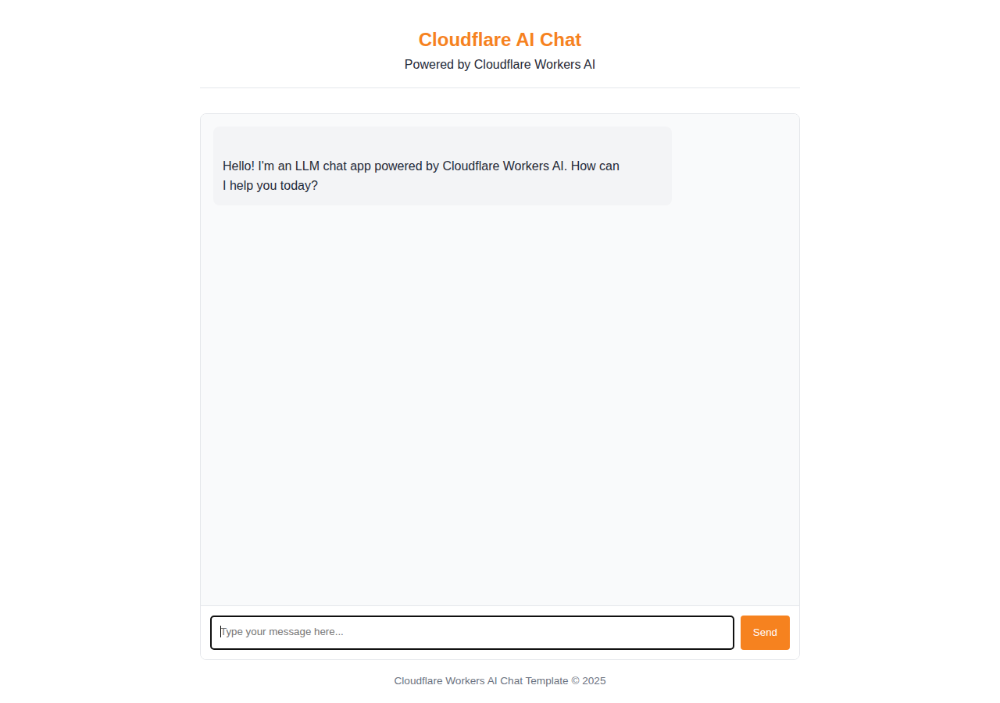

# ChatForge — Cloudflare Workers AI Chat

**Version:** v1.0  
**Status:** Active Development  
**Repository:** https://github.com/OneByJorah/ChatForge

---

## Table of Contents

- [Overview](#overview)
- [Architecture](#architecture)
- [Technology Stack](#technology-stack)
- [Features](#features)
- [Getting Started](#getting-started)
- [Service Management](#service-management)
- [Project Structure](#project-structure)
- [Screenshots](#screenshots)
- [Contributing](#contributing)
- [License](#license)
- [Author](#author)

---

## Overview

ChatForge is a simple chat application powered by Cloudflare Workers AI. It runs entirely on the edge, uses Workers AI for model inference, and streams responses to a lightweight HTML5 frontend.

---

## Architecture

Client browser → static frontend (`public/index.html` + `public/chat.js`) → Cloudflare Worker (`src/index.ts`) → Workers AI → streaming response.

The frontend posts messages to the Worker, which calls Workers AI and streams tokens back. No origin server required.

---

## Technology Stack

| Layer | Stack |
|---|---|
| Runtime | Cloudflare Workers |
| Backend | TypeScript / Workers AI |
| Frontend | HTML5 + JavaScript |
| Tooling | Wrangler, Vitest, Workers TypeGen |
| VCS | Git + GitHub (`github.com/OneByJorah/ChatForge`) |

---

## Features

- **Edge-native runtime**: Cloudflare Workers with zero cold-start servers.
- **LLM chat**: Workers AI model inference.
- **Streaming responses**: live token delivery to the UI.
- **Typed worker config**: `wrangler.jsonc` + generated types.
- **Local preview**: Wrangler dev mode for local iteration.

---

## Getting Started

```bash
# 1. Clone
git clone https://github.com/OneByJorah/ChatForge.git
cd ChatForge

# 2. Install
npm install

# 3. Type generation
npm run cf-typegen

# 4. Local dev
npx wrangler dev

# 5. Deploy
npx wrangler deploy
```

---

## Service Management

```bash
# Dev loop (local)
npx wrangler dev

# Dry-run validation
npm run check

# Publish
npx wrangler deploy
```

---

## Project Structure

```
ChatForge/
├── src/
│   ├── index.ts
│   └── types.ts
├── public/
│   ├── index.html
│   └── chat.js
├── worker-configuration.d.ts
├── wrangler.jsonc
├── tsconfig.json
├── package.json
└── docs/screenshots/
    └── chatforge-ui.png
```

---

## Screenshots

### ChatForge UI


---

## Contributing

1. Create a feature branch off `main`.
2. Run `npm run check` before submitting.
3. Submit a PR with description and screenshots for UI changes.

---

## License

MIT

---

## Author

Built by **Jhonattan L. Jimenez**.
