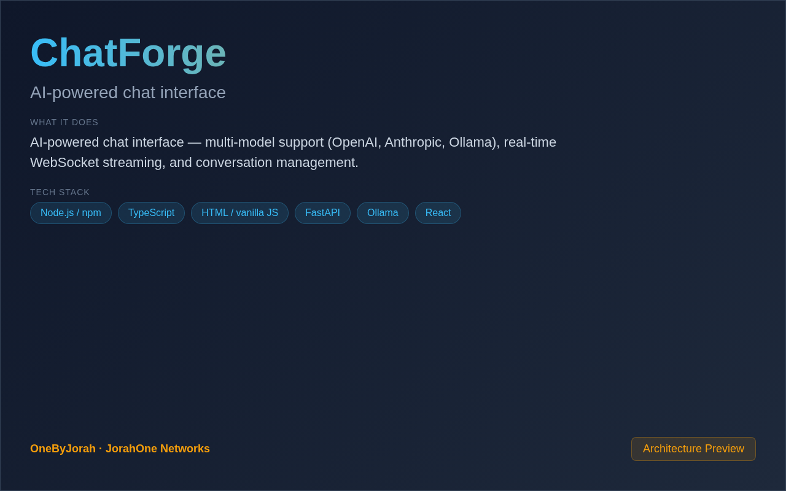

<div align="center">


# ChatForge

AI-powered chat interface


</div>

---

<p align="center">
  
</p>

<br>

---

## Features

- **Multi-Model Support** — OpenAI GPT-4/3.5, Anthropic Claude, and local Ollama models.
- **Real-Time Streaming** — WebSocket-based live response streaming.
- **Conversation Management** — Create, save, and switch between chat sessions.
- **User Authentication** — Secure login with session management.
- **Dark/Light Themes** — Customizable interface themes.
- **Markdown Rendering** — Full markdown support with syntax highlighting.
- **Code Execution** — Run code snippets directly in the chat.
- **Cloudflare Workers** — Deploy to the edge for global low-latency access.
- **Docker Support** — Self-host with Docker Compose.

## Quick Start

### Cloudflare Workers (Recommended)

```bash
git clone https://github.com/OneByJorah/ChatForge.git
cd ChatForge

cp wrangler.toml.example wrangler.toml
# Edit wrangler.toml with your keys

npm install
npm run deploy
```

### Docker Self-Host

```bash
docker compose up -d
```

Open **http://localhost:3000** in your browser.

## Environment Variables

| Variable | Default | Description |
|----------|---------|-------------|
| `OPENAI_API_KEY` | *(empty)* | OpenAI API key |
| `ANTHROPIC_API_KEY` | *(empty)* | Anthropic API key |
| `OLLAMA_URL` | `http://localhost:11434` | Ollama API endpoint |
| `JWT_SECRET` | *(empty)* | Secret for JWT authentication |
| `DATABASE_URL` | — | Database for conversation storage |
| `PORT` | `3000` | Server port (Docker mode) |

## Architecture

```
Browser ──WebSocket──▶ Cloudflare Worker / Node.js
                          │
                          ├──▶ OpenAI API
                          ├──▶ Anthropic API
                          ├──▶ Ollama (local)
                          └──▶ D1/KV Storage
```

## Tech Stack

- **Runtime**: Cloudflare Workers (edge) or Node.js
- **Frontend**: Vanilla JS with WebSocket
- **AI Providers**: OpenAI, Anthropic, Ollama
- **Storage**: Cloudflare D1/KV or SQLite
- **Auth**: JWT-based authentication
- **Deployment**: Cloudflare Workers, Docker, VPS

## Supported Models

| Provider | Models |
|----------|--------|
| **OpenAI** | GPT-4, GPT-4 Turbo, GPT-3.5 Turbo |
| **Anthropic** | Claude 3 Opus, Claude 3 Sonnet, Claude 2 |
| **Ollama** | Llama 2, Mistral, CodeLlama, and more |

## Project Structure

```
ChatForge/
├── src/
│   ├── index.js           # Worker entry point
│   ├── chat.js            # Chat handler
│   ├── auth.js            # Authentication
│   └── models.js          # AI model integrations
├── public/
│   ├── index.html         # Chat interface
│   ├── app.js             # Frontend logic
│   └── styles.css         # Theme styles
├── docker-compose.yml     # Docker deployment
├── wrangler.toml          # Cloudflare Workers config
└── .env.example           # Configuration template
```

## API Endpoints

| Endpoint | Method | Description |
|----------|--------|-------------|
| `/api/chat` | POST | Send message and get response |
| `/api/chat/stream` | POST | Stream response via WebSocket |
| `/api/conversations` | GET | List user conversations |
| `/api/conversations/:id` | GET | Get conversation history |
| `/api/auth/login` | POST | User login |
| `/api/auth/register` | POST | User registration |

## Contributing

Contributions are welcome. Please see [CONTRIBUTING.md](CONTRIBUTING.md) for guidelines and [CODE_OF_CONDUCT.md](CODE_OF_CONDUCT.md) for community standards.

## Security

For security concerns, see [SECURITY.md](SECURITY.md). Please report vulnerabilities to **info@jorahone.com** — do not use public issues.

## License

MIT © Jhonattan L. Jimenez

---

## 🤝 Contributing

See [CONTRIBUTING.md](CONTRIBUTING.md). All contributions follow the [Code of Conduct](CODE_OF_CONDUCT.md).

## 🔒 Security

Found a vulnerability? Please follow our [Security Policy](SECURITY.md) and report privately to `security@jorahone.com`.

## 📄 License

[MIT License](LICENSE) © Jhonattan L. Jimenez (OneByJorah)

---

<p align="center">Built with 🌴 by <a href="https://github.com/OneByJorah">OneByJorah</a> · <a href="https://jorahone.com">jorahone.com</a></p>
