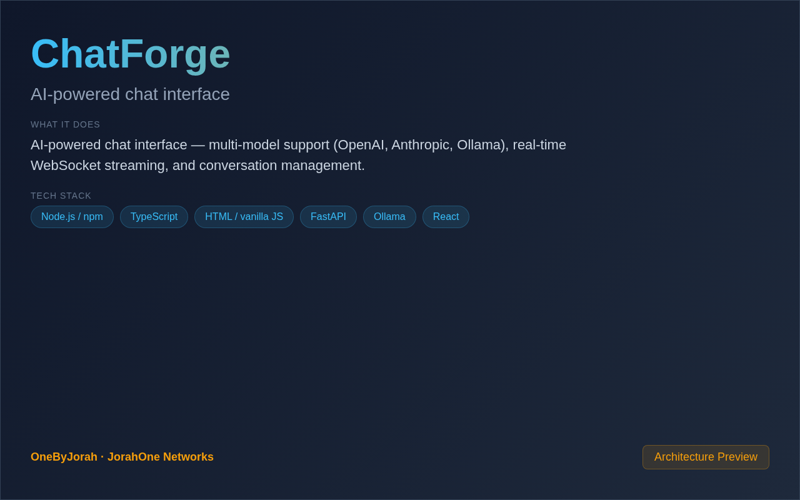
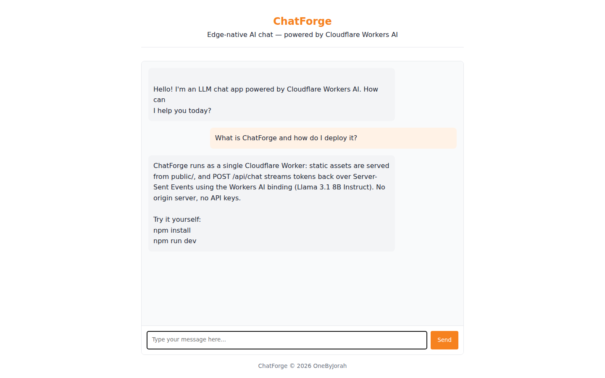
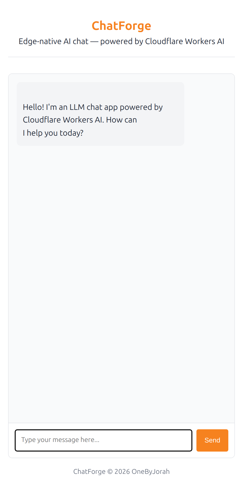
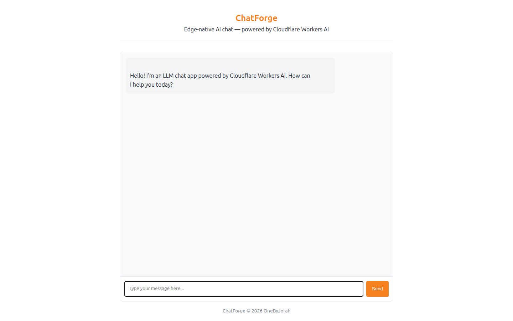

<div align="center">


# ChatForge

**Edge-native AI chat interface** — a single Cloudflare Worker serving a streaming chat UI powered by Workers AI, with no origin server.

<a href="https://github.com/OneByJorah/ChatForge/stargazers"></a>
<a href="https://github.com/OneByJorah/ChatForge/commits"></a>




</div>

## Quick Start

```bash
git clone https://github.com/OneByJorah/ChatForge.git
cd ChatForge
npm install
npx wrangler login
npm run dev
```

Open **http://localhost:8787**. Run `npm run deploy` to publish to Cloudflare Workers.

## What This Is

ChatForge is a reference implementation of an edge-hosted chat app: a static frontend plus a streaming `/api/chat` endpoint, both running inside one Cloudflare Worker and calling Workers AI through a binding. There is no backend server, no API key to manage, and no cold-start regional infrastructure. It exists as a clean starting point you can fork and extend for your own product.

> [!NOTE]
> ChatForge is intentionally minimal: **no authentication, no persistence, and no rate limiting**. Chat history lives in browser memory and resets on refresh. See [docs/ARCHITECTURE.md](docs/ARCHITECTURE.md) for the production upgrade path.

## Features

- **Workers AI inference** — runs `@cf/meta/llama-3.1-8b-instruct-fp8` at the edge with no API keys.
- **Real-time streaming** — Server-Sent Events (SSE) deliver tokens as they are generated.
- **Single-Worker deploy** — frontend and API ship together with one `wrangler deploy`.
- **Framework-free frontend** — vanilla HTML/CSS/JS keeps the whole UI small.
- **Security headers** — CSP, HSTS, `X-Frame-Options`, `nosniff`, referrer, and permissions policies on every response.
- **Input validation** — server-side limits on message shape, count (max 100), and length (max 32,000 chars).
- **Swappable model** — change `MODEL_ID` in `src/index.ts` to any Workers AI text-generation model.
- **Docker preview** — serve the static UI locally with `docker compose up` for a quick look.

## Architecture

```
Browser ──SSE──▶ Cloudflare Worker (src/index.ts)
                     │
                     ├── GET /* ──▶ env.ASSETS.fetch() ──▶ public/ (static files)
                     │
                     └── POST /api/chat ──▶ env.AI.run() ──▶ Workers AI (Llama 3.1 8B)
                                                 │
                                                 └── text/event-stream response
```

Chat history is kept in browser memory only. The Worker is stateless.

## API

| Endpoint | Method | Description |
|----------|--------|-------------|
| `/api/chat` | `POST` | Send `{ "messages": [...] }`, receive an SSE-streamed reply |
| `/*` (non-API) | `GET` | Static frontend from `public/` |

Errors: `400` invalid JSON/messages, `405` wrong method, `404` unknown API route, `500` AI failure. Full details in [docs/API.md](docs/API.md).

## Configuration

No runtime secrets are needed — the AI binding is declared in [`wrangler.jsonc`](wrangler.jsonc). Deployment credentials are read from the environment (never committed):

| Variable | Required | Description |
|----------|----------|-------------|
| `CLOUDFLARE_API_TOKEN` | For deploy | Cloudflare API token used by Wrangler |
| `CLOUDFLARE_ACCOUNT_ID` | For deploy | Cloudflare account ID |

See [.env.example](.env.example).

## Supported Models

| Provider | Model |
|----------|-------|
| **Cloudflare Workers AI** | `@cf/meta/llama-3.1-8b-instruct-fp8` (default, swappable via `MODEL_ID` in [src/index.ts](src/index.ts)) |

Browse the [Workers AI model catalog](https://developers.cloudflare.com/workers-ai/models/) — any text-generation model ID can be dropped in.

## Docker Preview

```bash
docker compose up -d   # http://localhost:8787
```

> [!WARNING]
> The Docker image previews only the static frontend. The `/api/chat` endpoint requires `wrangler dev` or a deployed Worker because it depends on the `env.AI` binding.

## Use Cases

1. **Starter template** — fork it as the base for a custom edge chat product.
2. **Learning Workers AI** — see streaming, bindings, and security headers in ~one file.
3. **Internal tools** — deploy a no-backend assistant for quick Q&A.
4. **Prototyping** — test prompts against Llama 3.1 at the edge with zero infrastructure.

## Tech Stack

Cloudflare Workers, Workers AI, TypeScript, vanilla HTML/CSS/JS, Server-Sent Events, Wrangler, Vitest, Docker (nginx:alpine preview).

## Screenshots

| View | Preview |
|------|---------|
| Chat UI |  |
| Conversation |  |
| Mobile |  |
| Main viewport |  |

## Project Structure

```
ChatForge/
├── src/                # Worker source
│   ├── index.ts        # Routing + chat API
│   ├── types.ts        # Type definitions
│   └── __tests__/      # Vitest suite
├── public/             # index.html + chat.js
├── wrangler.jsonc      # Cloudflare config
├── Dockerfile          # Static UI preview image
├── docker-compose.yml  # Local static preview
├── docs/               # API.md, ARCHITECTURE.md, assets
└── package.json
```

## Contributing

Contributions are welcome. Please read [CONTRIBUTING.md](CONTRIBUTING.md) and [CODE_OF_CONDUCT.md](CODE_OF_CONDUCT.md), then [open an issue](https://github.com/OneByJorah/ChatForge/issues) or a pull request.

## License

MIT — see [LICENSE](LICENSE).

## Connect

- [jorahone.com](https://jorahone.com)
- [GitHub Org](https://github.com/OneByJorah)
- [info@jorahone.com](mailto:info@jorahone.com)
