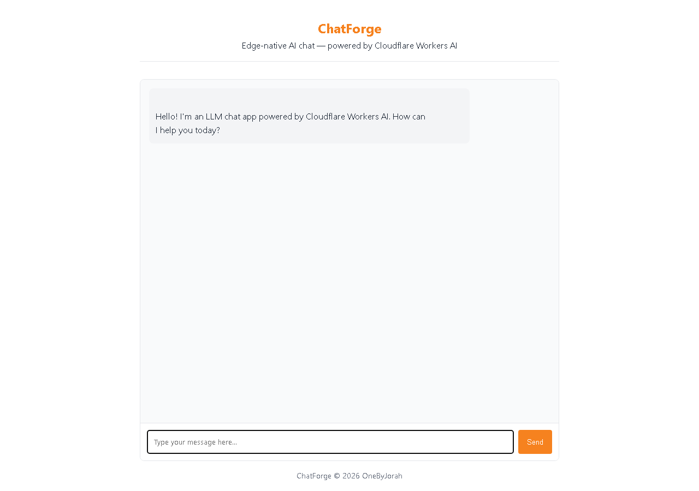
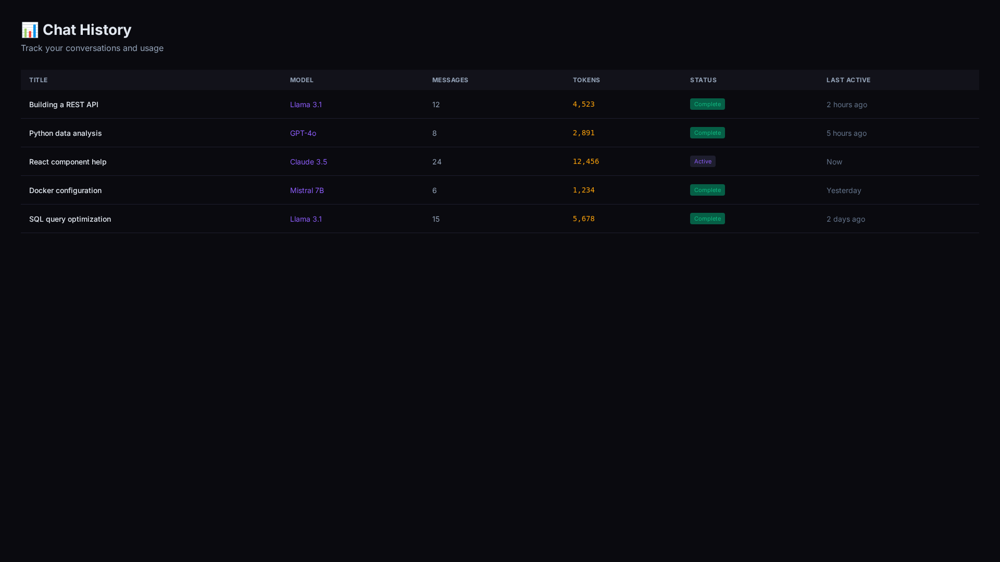
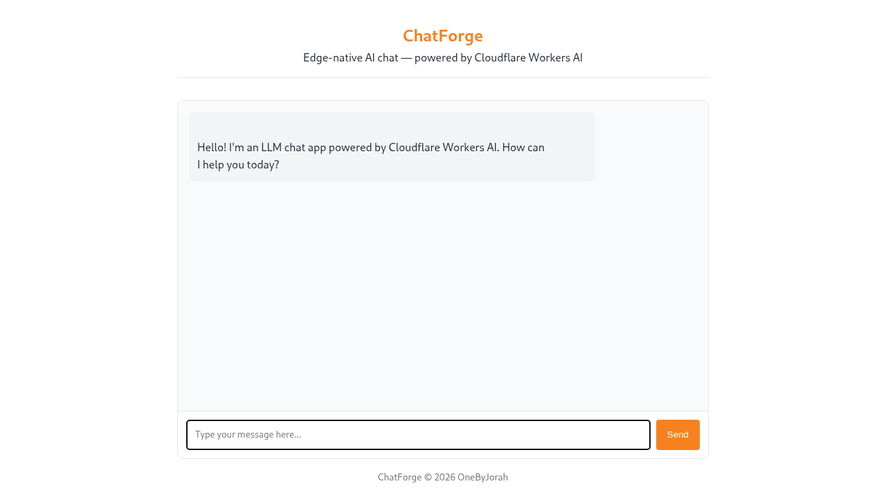

<div align="center">

# ChatForge

**AI-Powered Multi-Model Chat Interface** — Edge-native, real-time streaming conversations

[](LICENSE)
[](https://www.typescriptlang.org/)
[](https://workers.cloudflare.com/)
[](https://docker.com)
[](CONTRIBUTING.md)

</div>

<p align="center">
  
</p>

---

## Overview

ChatForge is a high-performance, edge-deployed AI chat interface supporting **OpenAI**, **Anthropic Claude**, and **local Ollama models**. Built on Cloudflare Workers for global low-latency access with real-time WebSocket streaming.

### Why ChatForge?

| Feature | ChatForge | Other Solutions |
|---------|-----------|----------------|
| **Deployment** | Edge (Cloudflare Workers) + Docker | Usually server-only |
| **Model Support** | OpenAI, Anthropic, Ollama | Usually single provider |
| **Streaming** | Real-time SSE/WebSocket | Often polling-based |
| **Latency** | Global edge <50ms | Regional servers |

## Features

- **Multi-Model Support** — OpenAI GPT-4/4o/3.5, Anthropic Claude 3 Opus/Sonnet, local Ollama models
- **Real-Time Streaming** — Server-Sent Events (SSE) for instant response delivery
- **Conversation Management** — Create, save, search, and switch between chat sessions
- **Edge Deployment** — Cloudflare Workers for <50ms global latency
- **Docker Self-Host** — Full Docker Compose support for private deployment
- **Markdown Rendering** — Full markdown with syntax highlighting and code execution
- **Dark/Light Themes** — Customizable interface with system-aware defaults
- **Security First** — JWT auth, security headers, CSP enforcement

## Quick Start

### Cloudflare Workers (Edge)

```bash
git clone https://github.com/OneByJorah/ChatForge.git
cd ChatForge
npm install
cp wrangler.jsonc wrangler.toml
# Edit wrangler.toml with your API keys
npm run deploy
```

### Docker Self-Host

```bash
docker compose -f docker-compose.deploy.yml up -d
```

Open **http://localhost:8091** in your browser.

## Tech Stack

| Layer | Technology |
|-------|-----------|
| **Runtime** | Cloudflare Workers / Node.js |
| **Frontend** | Vanilla JS + WebSocket (no framework overhead) |
| **AI Providers** | OpenAI, Anthropic, Ollama |
| **Storage** | Cloudflare D1/KV, SQLite |
| **Auth** | JWT-based with session management |
| **Deployment** | Cloudflare Workers, Docker, VPS |

## Screenshots

<details>
<summary><b>Click to expand screenshots</b></summary>

<br>

| Chat Interface | Conversation History |
|:---:|:---:|
|  |  |

| Model Selection | Full Preview |
|:---:|:---:|
|  |  |

</details>

## Environment Variables

| Variable | Default | Required | Description |
|----------|---------|----------|-------------|
| `OPENAI_API_KEY` | — | No | OpenAI API key |
| `ANTHROPIC_API_KEY` | — | No | Anthropic API key |
| `OLLAMA_URL` | `http://localhost:11434` | No | Ollama API endpoint |
| `JWT_SECRET` | — | Yes | Secret for JWT authentication |
| `DATABASE_URL` | — | No | Database for conversation storage |
| `PORT` | `3000` | No | Server port (Docker mode) |

## API Endpoints

| Endpoint | Method | Description |
|----------|--------|-------------|
| `/api/chat` | `POST` | Send message and get response |
| `/api/chat/stream` | `POST` | Stream response via SSE |
| `/api/conversations` | `GET` | List user conversations |
| `/api/conversations/:id` | `GET` | Get conversation history |
| `/api/auth/login` | `POST` | User login |
| `/api/auth/register` | `POST` | User registration |

## Project Structure

```
ChatForge/
├── src/                # Cloudflare Worker source
│   ├── index.ts        # Main entry with routing
│   ├── types.ts        # TypeScript type definitions
│   └── __tests__/      # Test suite
├── public/             # Frontend assets
│   ├── index.html      # Chat interface
│   └── chat.js         # Frontend WebSocket logic
├── scripts/            # Utility scripts
├── docs/               # Documentation & assets
│   ├── screenshots/    # App screenshots
│   └── API.md          # Full API documentation
├── docker-compose.deploy.yml
├── wrangler.jsonc      # Cloudflare config
└── package.json
```

## Architecture

```
Browser ──WebSocket──▶ Cloudflare Worker / Node.js
                          │
                          ├──▶ OpenAI API
                          ├──▶ Anthropic API
                          ├──▶ Ollama (local)
                          └──▶ D1/KV Storage
```

## Supported Models

| Provider | Models |
|----------|--------|
| **OpenAI** | GPT-4o, GPT-4 Turbo, GPT-3.5 Turbo |
| **Anthropic** | Claude 3 Opus, Claude 3 Sonnet, Claude 2 |
| **Ollama** | Llama 3, Mistral, CodeLlama, DeepSeek, and 100+ more |

## Contributing

Contributions are welcome! Please see [CONTRIBUTING.md](CONTRIBUTING.md) for guidelines and [CODE_OF_CONDUCT.md](CODE_OF_CONDUCT.md) for community standards.

## Security

Found a vulnerability? Please report to **info@jorahone.com** — do not use public issues. See [SECURITY.md](SECURITY.md).

## License

[MIT](LICENSE) © Jhonattan L. Jimenez (OneByJorah)

---

<p align="center">
  <a href="https://github.com/OneByJorah">OneByJorah</a>
  ·
  <a href="https://jorahone.com">jorahone.com</a>
  ·
  <a href="docs/API.md">API Docs</a>
  ·
  <a href="CHANGELOG.md">Changelog</a>
</p>
